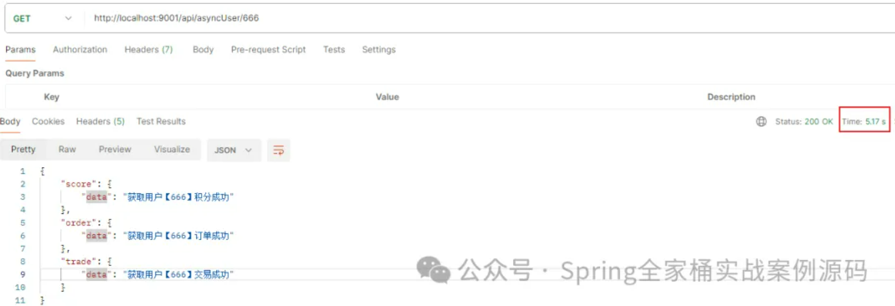
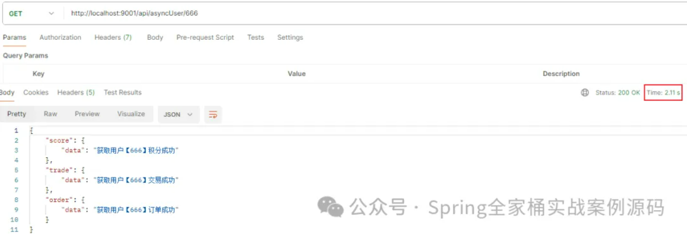
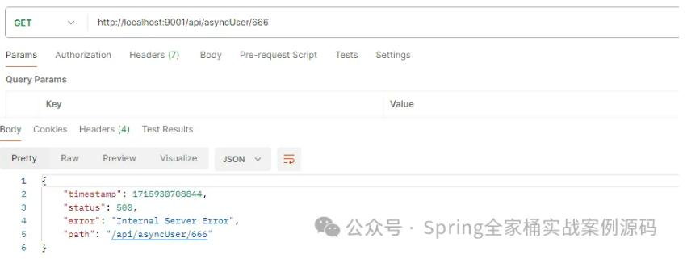
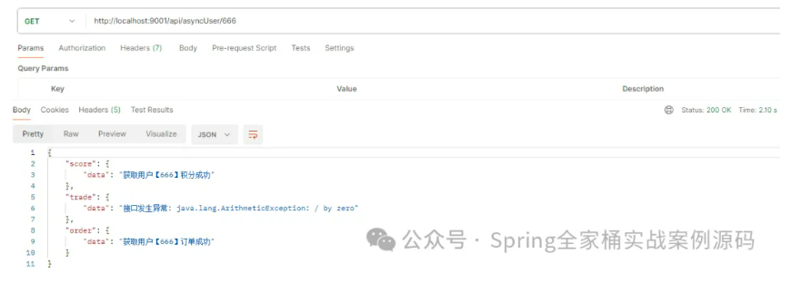

# test01：解析数学表达式


> https://blog.csdn.net/G971005287W/article/details/122668122
>
> https://github.com/scireum/parsii

# 拖拽排序后台设计与实现

> https://blog.csdn.net/sdujava2011/article/details/135700047

## 前言

项目中有一个需求是拖拽排序，将类似卡片的东西拖拽重新排列
有以下几个需求:

- 允许更改元素的排序
- 允许新增数据，并更新现有排序
- 允许删除数据，并更新现有排序

## 实现思路

### 一、全量更新元素位置法

适用场景：排序[元素数量](https://so.csdn.net/so/search?q=元素数量&spm=1001.2101.3001.7020)较少，对于大量数据排序不适用
原理：每一个元素拥有一个字段，表示元素当前排序的位置，通过前端排序，将排好的元素位置，一次性发送到后端。然后，后端统一更新所有元素的位置
具体实现：
实体设计：增加[排序字段](https://so.csdn.net/so/search?q=排序字段&spm=1001.2101.3001.7020)sort，表示元素当前的位置。例如，sort=1，则表示元素处于第一位
接口设计：

```bash
前端发送id数组，数组的索引表示数组当前的排序位置
例如：[3,2,4,1] 表示id为3的sortId为1，id为4的数组sortId为3
12
```

移动元素：移动元素后前端将id数组发送给后台
删除元素：删除元素直接删除id对应的元素对排序没什么影响，不过可能出现sortId出现跳过某个值的情况。也可以删除前端发过来数组中不存在而服务器端存在的元素，然后根据删除后的数组元素进行全部更新
新增元素：新增元素时如果想要放在最后一位，那么sortId为sortId的最大值加一，如果想要将新增的元素放在第一位，那么将前端把新加的数组放在第一位，发数组id给后端再进行全排序

### 二、取中值法

适用场景：数据量较多，移动次数不是很频繁
原理：新加一个字段sortId，每个字段之间的间隔都很大，例如第一个65536，第一个为2*65536，当改变了某个元素的位置时，只要前端发送这个元素id和想要移动到的位置的id对应的sortId，后台根据拖拽的位置进行更新
具体实现：
1、移动元素：

- 调整一个元素到两个元素之间时，此元素的sortId为调整后位置前后两个元素的sortId相加处于二，即sortId = (pre_sortId + after_sortId)/2
- 调整一个元素到第一个元素，此元素的sortId为第一个元素的一半，即sortId = first_sortId / 2
- 调整一个元素到最后一个元素时，此元素的sortId为最后一个元素加65536，即sortId = old_sortId + 65536

2、删除元素
不影响排序

3、新增元素
创建第一个元素时默认为65536，第二个元素为265536，第N个元素为N65536

注意点:
理论上这种方式可以一直变更顺序，但是考虑到由于精度的限制，所以sortId在某个情况下就可能变得变得很小导致排序失效，所以有两个方法，一是设置一个安全值，当sortId低于这个安全值时就进行全表的重排，二是通过定时全表进行更新

### 三、单表单列

适用场景：快取取出某一位置的元素，查询次数多修改频率少的
每个元素，都有一个字段index，表示元素的排序信息
规定元素从0开始递增。
具体实现：
1、新增元素
新增元素时，序号为当前元素数据总量-1
2、删除元素
删除元素时，将大于该序号的元素index都减一
3、修改元素
前端发送一个偏移量，有正有负，比如从第五移动到第三，那么偏移量就是-2，那么移动的元素的index加上偏移量，然后将移动元素的原位置的偏移量范围内的元素进行加减
例如：
第六移动到第三，偏移量为-3，那么将第三到第五的位置index都加一，将当前元素的index加上偏移量，即5-3=2，在第三个位置上

# test02：spring之@Import注解

> https://blog.csdn.net/K_520_W/article/details/131028732
>
> [Java动态代理机制](https://javaguide.cn/java/basis/proxy.html)

## 1、@Import出现的背景

> 目前为止，注解的方式批量注册bean，前面2篇文章中，我们介绍了2种方式：
>
> 到目前，我们知道的批量定义bean的方式有2种：
>
> - @Configuration结合@Bean注解的方式
> - @CompontentScan扫描包的方式

### 1.1、问题1

如果需要注册的类是在第三方的jar中，那么我们如果想注册这些bean有2种方式：

- 通过@Bean标注方法的方式，一个个来注册
- @CompontentScan的方式：默认的@CompontentScan是无能为力的，默认情况下只会注册@Compontent标注的类，此时只能自定义@CompontentScan中的过滤器来实现了

这2种方式都不是太好，每次有变化，调整的代码都比较多。

### 1.2、问题2

​    通常我们的项目中有很多子模块，可能每个模块都是独立开发的，最后通过jar的方式引进来，**每个模块中都有各自的@Configuration、@Bean标注的类，或者使用@CompontentScan标注的类，被@Configuration、@Bean、@CompontentScan标注的类，我们统称为bean配置类，配置类可以用来注册bean**，此时如果我们只想使用其中几个模块的配置类，怎么办？

@Import可以很好的解决这2个问题，下面我们来看@Import怎么玩的。

## 2、@Import使用

> ​    先看Spring对它的注释，总结下来作用就是和xml配置的 <import />标签作用一样，允许通过它引入@Configuration标注的类 ， 引入ImportSelector接口和ImportBeanDefinitionRegistrar接口的实现，也包括 @Component注解的普通类。
>
> ​    **总的来说：@Import可以用来批量导入需要注册的各种类，如普通的类、配置类，完后完成普通类和配置类中所有bean的注册。**

@Import的源码：

```java
@Target(ElementType.TYPE)
@Retention(RetentionPolicy.RUNTIME)
@Documented
public @interface Import {
 
    /**
     * {@link Configuration @Configuration}, {@link ImportSelector},
     * {@link ImportBeanDefinitionRegistrar}, or regular component classes to import.
     */
    Class<?>[] value();
 
}
```

>   @Import可以使用在任何类型上，通常情况下，类和注解上用的比较多。
>
> value：一个Class数组，设置需要导入的类，可以是@Configuration标注的列，可以是ImportSelector接口或者ImportBeanDefinitionRegistrar[接口类型](https://so.csdn.net/so/search?q=接口类型&spm=1001.2101.3001.7020)的，或者需要导入的普通组件类。

###  2.1、使用步骤

- 将@Import标注在类上，设置value参数
- 将@Import标注的类作为AnnotationConfigApplicationContext构造参数创建AnnotationConfigApplicationContext对象
- 使用AnnotationConfigApplicationContext对象

### 2.1、使用步骤

- 将@Import标注在类上，设置value参数
- 将@Import标注的类作为AnnotationConfigApplicationContext构造参数创建AnnotationConfigApplicationContext对象
- 使用AnnotationConfigApplicationContext对象

### 2.2、@Import的value常见的有5种用法

- **value为普通的类**
- **value为@Configuration标注的类**
- **value为@CompontentScan标注的类**
- **value为ImportBeanDefinitionRegistrar接口类型**
- **value为ImportSelector接口类型**
- **value为DeferredImportSelector接口类型**

## 3、@Import使用之value为普通的类 

### 3.1、定义两个类

#### 3.1.1、Service1：

```java
package com.javacode2018.lesson001.demo24.test1;

public class Service1 {
}
```

#### 3.1.2、Service2：

```java
package com.javacode2018.lesson001.demo24.test1;

public class Service2 {
}
```

#### 3.1.3、总配置类：使用@Import标注

```java
package com.javacode2018.lesson001.demo24.test1;

import org.springframework.context.annotation.Import;

@Import({Service1.class, Service2.class})
public class MainConfig1 {
}
```

@Import中导入了2个普通的类：Service1、Service2，这两个类会被自动注册到容器中

#### 3.1.4、测试用例

```java
package com.javacode2018.lesson001.demo24;

import com.javacode2018.lesson001.demo24.test1.MainConfig1;
import org.junit.Test;
import org.springframework.context.annotation.AnnotationConfigApplicationContext;
public class ImportTest {

    @Test
    public void test1() {

        //1.通过AnnotationConfigApplicationContext创建spring容器，参数为@Import标注的类
        AnnotationConfigApplicationContext context = new AnnotationConfigApplicationContext(MainConfig1.class);
        //2.输出容器中定义的所有bean信息
        for (String beanName : context.getBeanDefinitionNames()) {
            System.out.println(String.format("%s->%s", beanName, context.getBean(beanName)));
        }
    }
}
```

部分输出如下：

```java
com.javacode2018.lesson001.demo24.test1.Service1->com.javacode2018.lesson001.demo24.test1.Service1@7e0b85f9

com.javacode2018.lesson001.demo24.test1.Service2->com.javacode2018.lesson001.demo24.test1.Service2@63355449
```

###  3.2、结果分析

> 从输出中可以看出：
>
> 1. Service1和Service2成功注册到容器了。
> 2. 通过@Import导入的2个类，bean名称为完整的类名
>
> 我们也可以指定被导入类的bean名称，使用@Compontent注解就可以了，如下：
>
> ```java
> @Component("service1")
> public class Service1 {
> }
> ```

再次运行test1输出：

```java
service1->com.javacode2018.lesson001.demo24.test1.Service1@45efd90f
```

**总结一下**

​    ***\*按模块的方式进行导入，需要哪个导入哪个，不需要的时候，直接修改一下总的配置类，调整一下@Import就可以了，非常方便\**。**

------

## 4、value为@Configuration标注的配置类

项目比较大的情况下，会按照模块独立开发，每个模块在maven中就表现为一个个的构建，然后通过坐标的方式进行引入需要的模块。

假如项目中有2个模块，2个模块都有各自的配置类，如下

### 4.1、模块1配置类

```java
package com.javacode2018.lesson001.demo24.test2;
 
import org.springframework.context.annotation.Bean;
import org.springframework.context.annotation.Configuration;
 
/**
 * 模块1配置类
 */
@Configuration
public class ConfigModule1 {
    @Bean
    public String module1() {
        return "我是模块1配置类！";
    }
}
```

### 4.2、模块2配置类

```java
package com.javacode2018.lesson001.demo24.test2;
 
import org.springframework.context.annotation.Bean;
import org.springframework.context.annotation.Configuration;
 
/**
 * 模块2配置类
 */
@Configuration
public class ConfigModule2 {
    @Bean
    public String module2() {
        return "我是模块2配置类！";
    }
}
```

### 4.3、总配置类：通过@Import导入2个模块的配置类

```java
package com.javacode2018.lesson001.demo24.test2;
 
import org.springframework.context.annotation.Import;
 
/**
 * 通过Import来汇总多个@Configuration标注的配置类
 */
@Import({ConfigModule1.class, ConfigModule2.class}) //@1
public class MainConfig2 {
}
```

> @1导入了2个模块中的模块配置类，可以按需导入。

### 4.4、测试用例

ImportTest中新增个方法

```java
@Test
public void test2() {
    //1.通过AnnotationConfigApplicationContext创建spring容器，参数为@Import标注的类
    AnnotationConfigApplicationContext context = new AnnotationConfigApplicationContext(MainConfig2.class);
    //2.输出容器中定义的所有bean信息
    for (String beanName : context.getBeanDefinitionNames()) {
        System.out.println(String.format("%s->%s", beanName, context.getBean(beanName)));
    }
}
```

运行输出：

```java
mainConfig2->com.javacode2018.lesson001.demo24.test2.MainConfig2@ba2f4ec
com.javacode2018.lesson001.demo24.test2.ConfigModule1->com.javacode2018.lesson001.demo24.test2.ConfigModule1$$EnhancerBySpringCGLIB$$700e65cd@1c1bbc4e
module1->我是模块1配置类！
com.javacode2018.lesson001.demo24.test2.ConfigModule2->com.javacode2018.lesson001.demo24.test2.ConfigModule2$$EnhancerBySpringCGLIB$$a87108ee@55fe41ea
module2->我是模块2配置类！
```

------

## 5、value为@CompontentScan标注的类

项目中分多个模块，每个模块有各自独立的包，我们在每个模块所在的包中配置一个@CompontentScan类，然后通过@Import来导入需要启用的模块。

### 5.1、定义模块1

2个组件和一个组件扫描类，模块1所有类所在的包为：

```java
com.javacode2018.lesson001.demo24.test3.module1
```

组件1：Module1Service1

```java
package com.javacode2018.lesson001.demo24.test3.module1;
 
import org.springframework.stereotype.Component;
 
@Component
public class Module1Service1 {
}
```

组件2：Module1Service2

```java
package com.javacode2018.lesson001.demo24.test3.module1;
 
import org.springframework.stereotype.Component;
 
@Component
public class Module1Service2 {
}
```

组件扫描类：CompontentScanModule1

负责扫描当前模块中的组件

```java
package com.javacode2018.lesson001.demo24.test3.module1;
 
import org.springframework.context.annotation.ComponentScan;
import org.springframework.stereotype.Component;
 
/**
 * 模块1的主键扫描
 */
@ComponentScan
public class CompontentScanModule1 {
}
```

### 5.2、同样的方式定义模块2

2个组件和一个组件扫描类，模块1所有类所在的包为：

```java
com.javacode2018.lesson001.demo24.test3.module2
```

组件1：Module2Service1

```java
package com.javacode2018.lesson001.demo24.test3.module2;
 
import org.springframework.stereotype.Component;
 
@Component
public class Module2Service1 {
}
```

组件2：Module2Service2

```java
package com.javacode2018.lesson001.demo24.test3.module2;
 
import org.springframework.stereotype.Component;
 
@Component
public class Module2Service2 {
}
```

组件扫描类：CompontentScanModule1

负责扫描当前模块中的组件

```java
package com.javacode2018.lesson001.demo24.test3.module2;
 
import org.springframework.context.annotation.ComponentScan;
import org.springframework.stereotype.Component;
 
/**
 * 模块2的组件扫描
 */
@ComponentScan
public class CompontentScanModule2 {
}
```

### 5.3、总配置类：通过@Import导入每个模块中的组件扫描类

```java
package com.javacode2018.lesson001.demo24.test3;
 
import com.javacode2018.lesson001.demo24.test3.module1.CompontentScanModule1;
import com.javacode2018.lesson001.demo24.test3.module2.CompontentScanModule2;
import org.springframework.context.annotation.Import;
 
/**
 * 通过@Import导入多个@CompontentScan标注的配置类
 */
@Import({CompontentScanModule1.class, CompontentScanModule2.class}) //@1
public class MainConfig3 {
}
```

> @1导入了2个模块中的组件扫描类，可以按需导入。

###  5.4、测试用例

ImportTest中新增个方法

```java
@Test
public void test3() {
    //1.通过AnnotationConfigApplicationContext创建spring容器，参数为@Import标注的类
    AnnotationConfigApplicationContext context = new AnnotationConfigApplicationContext(MainConfig3.class);
    //2.输出容器中定义的所有bean信息
    for (String beanName : context.getBeanDefinitionNames()) {
        System.out.println(String.format("%s->%s", beanName, context.getBean(beanName)));
    }
}
```

运行输出：

```java
module1Service1->com.javacode2018.lesson001.demo24.test3.module1.Module1Service1@5b239d7d
module1Service2->com.javacode2018.lesson001.demo24.test3.module1.Module1Service2@6572421
module2Service1->com.javacode2018.lesson001.demo24.test3.module2.Module2Service1@6b81ce95
module2Service2->com.javacode2018.lesson001.demo24.test3.module2.Module2Service2@2a798d51
```

两个模块中通过@Compontent定义的4个bean都输出了。

如果只想注册模块1中的bean，只需要修改一下@Import，去掉CompontentScanModule2，如下：

```java
@Import({CompontentScanModule1.class})
```

再次运行输出：

```java
module1Service1->com.javacode2018.lesson001.demo24.test3.module1.Module1Service1@6379eb
module1Service2->com.javacode2018.lesson001.demo24.test3.module1.Module1Service2@294425a7
```

此时模块2的bean就没有了。

## 6、了解一下相关的几个接口

### 6.1、ImportBeanDefinitionRegistrar接口

> **这个接口提供了通过spring容器api的方式直接向容器中注册bean**。
>
> 接口的完整名称：
>
> ```java
> org.springframework.context.annotation.ImportBeanDefinitionRegistrar
> ```
>
> 源码：
>
> ```java
> public interface ImportBeanDefinitionRegistrar {
>  
>     default void registerBeanDefinitions(AnnotationMetadata importingClassMetadata, BeanDefinitionRegistry registry,
>             BeanNameGenerator importBeanNameGenerator) {
>  
>         registerBeanDefinitions(importingClassMetadata, registry);
>     }
>  
>     default void registerBeanDefinitions(AnnotationMetadata importingClassMetadata, BeanDefinitionRegistry registry) {
>     }
>  
> }
> ```
>
> 2个默认方法，都可以用来调用spring容器api来注册bean。
>
> 2个方法中主要有3个参数
>
> - **importingClassMetadata：**AnnotationMetadata类型的，通过这个可以获取被@Import注解标注的类所有注解的信息。
> - **registry：**BeanDefinitionRegistry类型，是一个接口，内部提供了注册bean的各种方法。
> - **importBeanNameGenerator：**BeanNameGenerator类型，是一个接口，内部有一个方法，用来生成bean的名称。

### 6.2、BeanDefinitionRegistry接口：bean定义注册器

bean定义注册器，提供了bean注册的各种方法，来看一下源码：

```java
public interface BeanDefinitionRegistry extends AliasRegistry {
 
    /**
     * 注册一个新的bean定义
     * beanName：bean的名称
     * beanDefinition：bean定义信息
     */
    void registerBeanDefinition(String beanName, BeanDefinition beanDefinition)
            throws BeanDefinitionStoreException;
 
    /**
     * 通过bean名称移除已注册的bean
     * beanName：bean名称
     */
    void removeBeanDefinition(String beanName) throws NoSuchBeanDefinitionException;
 
    /**
     * 通过名称获取bean的定义信息
     * beanName：bean名称
     */
    BeanDefinition getBeanDefinition(String beanName) throws NoSuchBeanDefinitionException;
 
    /**
     * 查看beanName是否注册过
     */
    boolean containsBeanDefinition(String beanName);
 
    /**
     * 获取已经定义（注册）的bean名称列表
     */
    String[] getBeanDefinitionNames();
 
    /**
     * 返回注册器中已注册的bean数量
     */
    int getBeanDefinitionCount();
 
    /**
     * 确定给定的bean名称或者别名是否已在此注册表中使用
     * beanName：可以是bean名称或者bean的别名
     */
    boolean isBeanNameInUse(String beanName);
 
}
```

基本上所有bean工厂都实现了这个接口，让bean工厂拥有bean注册的各种能力。

上面我们用到的`AnnotationConfigApplicationContext`类也实现了这个接口。

### 6.3、BeanNameGenerator接口：bean名称生成器

bean名称生成器，这个接口只有一个方法，用来生成bean的名称：

```java
public interface BeanNameGenerator {
    String generateBeanName(BeanDefinition definition, BeanDefinitionRegistry registry);
}
```

spring内置了3个实现：

- **DefaultBeanNameGenerator：**默认bean名称生成器，xml中bean未指定名称的时候，默认就会使用这个生成器，默认为：完整的类名#bean编号

- **AnnotationBeanNameGenerator：**注解方式的bean名称生成器，比如通过@Component(bean名称)的方式指定bean名称，如果没有通过注解方式指定名称，默认会将完整的类名作为bean名称。

- **FullyQualifiedAnnotationBeanNameGenerator：**

  将完整的类名作为bean的名称

### 6.4、[BeanDefinition](https://so.csdn.net/so/search?q=BeanDefinition&spm=1001.2101.3001.7020)接口：bean定义信息

​    用来表示bean定义信息的接口，我们向容器中注册bean之前，会通过xml或者其他方式定义bean的各种配置信息，bean的所有配置信息都会被转换为一个BeanDefinition对象，然后通过容器中BeanDefinitionRegistry接口中的方法，将BeanDefinition注册到spring容器中，完成bean的注册操作。

## 7、value为ImportBeanDefinitionRegistrar接口类型

### 7.1、用法（4个步骤）

> - 定义ImportBeanDefinitionRegistrar接口实现类，在registerBeanDefinitions方法中使用registry来注册bean
> - 使用@Import来导入步骤1中定义的类
> - 使用步骤2中@Import标注的类作为AnnotationConfigApplicationContext构造参数创建spring容器
> - 使用AnnotationConfigApplicationContext操作bean

### 7.2、案例

来2个普通的类。

Service1

```java
package com.javacode2018.lesson001.demo24.test4;
 
public class Service1 {
}
```

Service2

这个类中需要注入Service1

```java
package com.javacode2018.lesson001.demo24.test4;
 
public class Service2 {
    private Service1 service1;
 
    public Service1 getService1() {
        return service1;
    }
 
    public void setService1(Service1 service1) {
        this.service1 = service1;
    }
 
    @Override
    public String toString() {
        return "Service2{" +
                "service1=" + service1 +
                '}';
    }
}
```

来个类实现ImportBeanDefinitionRegistrar接口，然后在里面实现上面2个类的注册，如下：

MyImportBeanDefinitionRegistrar

```java
package com.javacode2018.lesson001.demo24.test4;
 
import org.springframework.beans.factory.config.BeanDefinition;
import org.springframework.beans.factory.support.BeanDefinitionBuilder;
import org.springframework.beans.factory.support.BeanDefinitionRegistry;
import org.springframework.context.annotation.ImportBeanDefinitionRegistrar;
import org.springframework.core.type.AnnotationMetadata;
 
 
public class MyImportBeanDefinitionRegistrar implements ImportBeanDefinitionRegistrar {
    @Override
    public void registerBeanDefinitions(AnnotationMetadata importingClassMetadata, BeanDefinitionRegistry registry) {
        //定义一个bean：Service1
        BeanDefinition service1BeanDinition = BeanDefinitionBuilder.genericBeanDefinition(Service1.class).getBeanDefinition();
        //注册bean
        registry.registerBeanDefinition("service1", service1BeanDinition);
 
        //定义一个bean：Service2，通过addPropertyReference注入service1
        BeanDefinition service2BeanDinition = BeanDefinitionBuilder.genericBeanDefinition(Service2.class).
                addPropertyReference("service1", "service1").
                getBeanDefinition();
        //注册bean
        registry.registerBeanDefinition("service2", service2BeanDinition);
    }
}
```

> 注意上面的registerBeanDefinitions方法，内部注册了2个bean，Service1和Service2。
>
> 上面使用了BeanDefinitionBuilder这个类，这个是BeanDefinition的构造器，内部提供了很多静态方法方便构建BeanDefinition对象。

上面定义的2个bean，和下面xml方式效果一样：

```XML
<bean id="service1" class="com.javacode2018.lesson001.demo24.test4.Service1" />
<bean id="service2" class="com.javacode2018.lesson001.demo24.test4.Service2">
    <property name="service1" ref="service1"/>
</bean>
```

来个测试用例

ImportTest中新增个方法

```java
@Test
public void test4() {
    //1.通过AnnotationConfigApplicationContext创建spring容器，参数为@Import标注的类
    AnnotationConfigApplicationContext context = new AnnotationConfigApplicationContext(MainConfig4.class);
    //2.输出容器中定义的所有bean信息
    for (String beanName : context.getBeanDefinitionNames()) {
        System.out.println(String.format("%s->%s", beanName, context.getBean(beanName)));
    }
}
```

运行输出

```java
service1->com.javacode2018.lesson001.demo24.test4.Service1@62150f9e
service2->Service2{service1=com.javacode2018.lesson001.demo24.test4.Service1@62150f9e}
```

## 8、value为ImportSelector接口类型

### 8.1、ImportSelector接口

导入选择器，看一下源码：

```java
public interface ImportSelector {
 
    /**
     * 返回需要导入的类名的数组，可以是任何普通类，配置类（@Configuration、@Bean、@CompontentScan等标注的类）
     * @importingClassMetadata：用来获取被@Import标注的类上面所有的注解信息
     */
    String[] selectImports(AnnotationMetadata importingClassMetadata);
 
}
```

### 8.2、用法（4个步骤）

> - 定义ImportSelector接口实现类，在selectImports返回需要导入的类的名称数组
> - 使用@Import来导入步骤1中定义的类
> - 使用步骤2中@Import标注的类作为AnnotationConfigApplicationContext构造参数创建spring容器
> - 使用AnnotationConfigApplicationContext操作bean

###  8.3、案例

来个普通类：Service1

```java
package com.javacode2018.lesson001.demo24.test5;
 
public class Service1 {
}
```

来个@Configuration标注的配置类：Module1Config

```java
package com.javacode2018.lesson001.demo24.test5;
 
import org.springframework.context.annotation.Bean;
import org.springframework.context.annotation.Configuration;
 
@Configuration
public class Module1Config {
    @Bean
    public String name() {
        return "公众号：路人甲java";
    }
 
    @Bean
    public String address() {
        return "上海市";
    }
}
```

上面定义了两个string类型的bean：name和address

下面自定义一个ImportSelector，然后返回上面2个类的名称

```java
package com.javacode2018.lesson001.demo24.test5;
 
import org.springframework.context.annotation.ImportSelector;
import org.springframework.core.type.AnnotationMetadata;
 
public class MyImportSelector implements ImportSelector {
    @Override
    public String[] selectImports(AnnotationMetadata importingClassMetadata) {
        return new String[]{
                Service1.class.getName(),
                Module1Config.class.getName()
        };
    }
}
```

来个@Import标注的类，导入MyImportSelector

```java
package com.javacode2018.lesson001.demo24.test5;
 
import com.javacode2018.lesson001.demo24.test4.MyImportBeanDefinitionRegistrar;
import org.springframework.context.annotation.Import;
 
/**
 * 通过@Import导入MyImportSelector接口实现类
 */
@Import({MyImportSelector.class})
public class MainConfig5 {
}
```

新增测试用例

ImportTest中新增个方法

```java
@Test
public void test5() {
    //1.通过AnnotationConfigApplicationContext创建spring容器，参数为@Import标注的类
    AnnotationConfigApplicationContext context = new AnnotationConfigApplicationContext(MainConfig5.class);
    //2.输出容器中定义的所有bean信息
    for (String beanName : context.getBeanDefinitionNames()) {
        System.out.println(String.format("%s->%s", beanName, context.getBean(beanName)));
    }
}
```

运行输出

部分输出如下：

```java
com.javacode2018.lesson001.demo24.test5.Service1->com.javacode2018.lesson001.demo24.test5.Service1@45b4c3a9
name->公众号：路人甲java
address->上海市
```

输出中可以看到Service1以及Module1Config中定义的2个bean都有了。

## 9、来一个牛逼的案例

### 9.1、需求

> 凡是类名中包含service的，调用他们内部任何方法，我们希望调用之后能够输出这些方法的耗时。

### 9.2、实现分析

> ​    之前我们讲过代理， 此处我们就可以通过代理来实现，bean实例创建的过程中，我们可以给这些bean生成一个代理，在代理中统计方法的耗时，这里面有2点： 
>
> - 创建一个代理类，通过代理来间接访问需要统计耗时的bean对象
> - 拦截bean的创建，给bean实例生成代理生成代理

### 9.3、具体实现

先来两个Service类

Service1

```java
package com.javacode2018.lesson001.demo24.test6;
 
import org.springframework.stereotype.Component;
 
@Component
public class Service1 {
    public void m1() {
        System.out.println(this.getClass() + ".m1()");
    }
}
```

 Service2

```java
package com.javacode2018.lesson001.demo24.test6;
 
import org.springframework.stereotype.Component;
 
@Component
public class Service2 {
    public void m1() {
        System.out.println(this.getClass() + ".m1()");
    }
}
```

创建统计耗时的代理类

下面我们使用[cglib](https://so.csdn.net/so/search?q=cglib&spm=1001.2101.3001.7020)来实现一个代理类，如下：

```java
package com.javacode2018.lesson001.demo24.test6;
 
 
import org.springframework.cglib.proxy.Enhancer;
import org.springframework.cglib.proxy.MethodInterceptor;
import org.springframework.cglib.proxy.MethodProxy;
 
import java.lang.reflect.Method;
 
public class CostTimeProxy implements MethodInterceptor {
    //目标对象
    private Object target;
 
    public CostTimeProxy(Object target) {
        this.target = target;
    }
 
    @Override
    public Object intercept(Object o, Method method, Object[] objects, MethodProxy methodProxy) throws Throwable {
        long starTime = System.nanoTime();
        //调用被代理对象（即target）的方法，获取结果
        Object result = method.invoke(target, objects); //@1
        long endTime = System.nanoTime();
        System.out.println(method + "，耗时(纳秒)：" + (endTime - starTime));
        return result;
    }
 
    /**
     * 创建任意类的代理对象
     *
     * @param target
     * @param <T>
     * @return
     */
    public static <T> T createProxy(T target) {
        CostTimeProxy costTimeProxy = new CostTimeProxy(target);
        Enhancer enhancer = new Enhancer();
        enhancer.setCallback(costTimeProxy);
        enhancer.setSuperclass(target.getClass());
        return (T) enhancer.create();
    }
}
```

拦截bean实例的创建，返回代理对象

这段代码定义了一个名为 `CostTimeProxy` 的类，它实现了 `MethodInterceptor` 接口，用于通过 CGLIB（一个强大的、高性能的代码生成库）来创建一个代理对象，以便在执行目标对象的方法时测量其耗时。以下是对代码的详细解释：

1. **引入依赖**：
   - `org.springframework.cglib.proxy.Enhancer`: CGLIB库中的类，用于动态生成类的子类。
   - `org.springframework.cglib.proxy.MethodInterceptor`: CGLIB库中的接口，用于拦截方法的调用。
   - `org.springframework.cglib.proxy.MethodProxy`: CGLIB库中的类，表示被代理方法的代理。
   - `java.lang.reflect.Method`: Java反射库中的类，表示方法。
2. **CostTimeProxy 类**：
   - 这是一个实现了 `MethodInterceptor` 接口的类。
   - 它有一个私有成员变量 `target`，用于存储目标对象（即你希望为其创建代理的对象）。
   - 构造函数 `CostTimeProxy(Object target)`：用于初始化 `target` 成员变量。
   - `intercept` 方法：这是 `MethodInterceptor` 接口需要实现的方法。当调用代理对象的方法时，此方法会被执行。
     - `long starTime = System.nanoTime();`：记录方法开始执行的时间（以纳秒为单位）。
     - `Object result = method.invoke(target, objects);`：通过反射调用目标对象的方法，并传递参数（`objects` 是方法参数数组）。
     - `long endTime = System.nanoTime();`：记录方法执行完毕的时间。
     - 打印方法名称和耗时。
     - 返回方法调用的结果。
3. **createProxy 方法**：
   - 这是一个静态泛型方法，用于创建并返回任意类的代理对象。
   - 它接受一个类型参数 `T` 和一个 `T` 类型的参数 `target`。
   - 在方法内部：
     - 创建一个 `CostTimeProxy` 对象，将 `target` 作为参数。
     - 创建一个 `Enhancer` 对象。
     - 使用 `setCallback` 方法设置回调为之前创建的 `CostTimeProxy` 对象。
     - 使用 `setSuperclass` 方法设置要代理的类为 `target` 的类。
     - 使用 `create` 方法创建并返回代理对象。

注意：

- 由于使用了反射和CGLIB，这段代码在运行时会有一定的性能开销。但在开发和测试阶段，用于测量方法耗时是非常有用的。
- `createProxy` 方法返回的代理对象是一个 `target` 类的子类，因此它只能用于非 `final` 类和非 `final` 方法的代理。如果尝试代理 `final` 类或 `final` 方法，将会抛出异常。
- 使用CGLIB创建的代理对象会覆盖目标类的所有非 `final` 方法。这意味着，当调用代理对象的任何非 `final` 方法时，都会执行 `intercept` 方法。

这里我们需要用到spring中的一个接口：

```java
org.springframework.beans.factory.config.BeanPostProcessor
 
public interface BeanPostProcessor {
 
    /**
     * bean初始化之后会调用的方法
     */
    @Nullable
    default Object postProcessBeforeInitialization(Object bean, String beanName) throws BeansException {
        return bean;
    }
 
    /**
     * bean初始化之后会调用的方法
     */
    @Nullable
    default Object postProcessAfterInitialization(Object bean, String beanName) throws BeansException {
        return bean;
    }
 
}
```

这个接口是bean处理器，内部有2个方法，分别在bean初始化前后会进行调用，以后讲声明周期的时候还会细说的，这里你只需要知道bean初始化之后会调用postProcessAfterInitialization方法就行，这个方法中我们会给bean创建一个代理对象。

下面我们创建一个BeanPostProcessor实现类：

```java
package com.javacode2018.lesson001.demo24.test6;
 
import com.javacode2018.lesson001.demo23.test4.CostTimeProxy;
import org.springframework.beans.BeansException;
import org.springframework.beans.factory.config.BeanPostProcessor;
import org.springframework.lang.Nullable;
 
public class MethodCostTimeProxyBeanPostProcessor implements BeanPostProcessor {
    @Nullable
    @Override
    public Object postProcessAfterInitialization(Object bean, String beanName) throws BeansException {
        if (bean.getClass().getName().toLowerCase().contains("service")) {
            return CostTimeProxy.createProxy(bean); //@1
        } else {
            return bean;
        }
    }
}
```

需要将MethodCostTimeProxyBeanPostProcessor注册到容器中才会起作用，下面我们通过@Import结合ImportSelector的方式来导入这个类，将其注册到容器中。

MethodCostTimeImportSelector

```java
package com.javacode2018.lesson001.demo24.test6;
 
 
import com.javacode2018.lesson001.demo23.test4.MethodCostTimeProxyBeanPostProcessor;
import org.springframework.context.annotation.ImportSelector;
import org.springframework.core.type.AnnotationMetadata;
 
public class MethodCostTimeImportSelector implements ImportSelector {
    @Override
    public String[] selectImports(AnnotationMetadata importingClassMetadata) {
        return new String[]{MethodCostTimeProxyBeanPostProcessor.class.getName()};
    }
}
```

来一个@Import来导入MethodCostTimeImportSelector

下面我们使用注解的方式，在注解上使用@Import，如下：

```java
package com.javacode2018.lesson001.demo24.test6;
 
 
import com.javacode2018.lesson001.demo23.test4.MethodCostTimeImportSelector;
import org.springframework.context.annotation.Import;
 
import java.lang.annotation.ElementType;
import java.lang.annotation.Retention;
import java.lang.annotation.RetentionPolicy;
import java.lang.annotation.Target;
 
@Target(ElementType.TYPE)
@Retention(RetentionPolicy.RUNTIME)
@Import(MethodCostTimeImportSelector.class)
public @interface EnableMethodCostTime {
}
```

来一个总的配置类

```java
package com.javacode2018.lesson001.demo24.test6;
 
import org.springframework.context.annotation.ComponentScan;
 
@ComponentScan
@EnableMethodCostTime //@1
public class MainConfig6 {
}
```

> 上面使用了@CompontentScan注解，此时会将Servce1和Service2这两个类注册到容器中。
>
> @1：此处使用了@EnableMethodCostTime注解，而@EnableMethodCostTime注解上使用了@Import(MethodCostTimeImportSelector.class)，此时MethodCostTimeImportSelector类中的MethodCostTimeProxyBeanPostProcessor会被注册到容器，会拦截bean的创建，创建耗时代理对象。

来个测试用例

ImportTest中新增个方法

```java
@Test
public void test6() {
    //1.通过AnnotationConfigApplicationContext创建spring容器，参数为@Import标注的类
    AnnotationConfigApplicationContext context = new AnnotationConfigApplicationContext(MainConfig6.class);
    Service1 service1 = context.getBean(Service1.class);
    Service2 service2 = context.getBean(Service2.class);
    service1.m1();
    service2.m1();
}
```

> 上面会调用service1和service2的方法

运行输出

```java
class com.javacode2018.lesson001.demo24.test6.Service1.m1()
public void com.javacode2018.lesson001.demo24.test6.Service1.m1()，耗时(纳秒)：74200
class com.javacode2018.lesson001.demo24.test6.Service2.m1()
public void com.javacode2018.lesson001.demo24.test6.Service2.m1()，耗时(纳秒)：33800
```

**太牛逼了，需求实现了。**

**如果我们不想开启方法耗时统计，只需要将MainConfig6上的@EnableMethodCostTime去掉就可以了，用起来是不是特别爽。**

**spring中有很多类似的注解，以@EnableXXX开头的注解，基本上都是通过上面这种方式实现的，如：**

```java
@EnableAspectJAutoProxy
@EnableCaching
@EnableAsync
```

------

## 10、DeferredImportSelector接口

> ​    **先给你透露一下，springboot中的核心功能@EnableAutoConfiguration就是靠DeferredImportSelector来实现的。**
>
> ​    DeferredImportSelector是ImportSelector的子接口，既然是ImportSelector的子接口，所以也可以通过@Import进行导入，这个接口和ImportSelector不同地方有两点：
>
> - 延迟导入
> - 指定导入的类的处理顺序

###  10.1、延迟导入

> ​    比如@Import的value包含了多个普通类、多个@Configuration标注的配置类、多个ImportSelector接口的实现类，多个ImportBeanDefinitionRegistrar接口的实现类，还有DeferredImportSelector接口实现类，此时spring处理这些被导入的类的时候，**会将DeferredImportSelector类型的放在最后处理，会先处理其他被导入的类，其他类会按照value所在的前后顺序进行处理**。
>
> ​    那么我们是可以做很多事情的，比如我们可以在DeferredImportSelector导入的类中判断一下容器中是否已经注册了某个bean，如果没有注册过，那么再来注册。
>
> ​    以后我们会讲到另外一个注解@Conditional，这个注解可以按条件来注册bean，比如可以判断某个bean不存在的时候才进行注册，某个类存在的时候才进行注册等等各种条件判断，**通过@Conditional来结合DeferredImportSelector可以做很多事情**。

### 10.2、来个延迟导入的案例 

来3个配置类，每个配置类中都通过@Bean定一个string类型的bean，内部输出一句文字。

Configuration1

```java
package com.javacode2018.lesson001.demo24.test7;
 
 
import org.springframework.context.annotation.Bean;
import org.springframework.context.annotation.Configuration;
 
@Configuration
public class Configuration1 {
    @Bean
    public String name1() {
        System.out.println("name1");
        return "name1";
    }
}
```

Configuration2

```java
package com.javacode2018.lesson001.demo24.test7;
 
 
import org.springframework.context.annotation.Bean;
import org.springframework.context.annotation.Configuration;
 
@Configuration
public class Configuration2 {
    @Bean
    public String name2() {
        System.out.println("name2");
        return "name2";
    }
}
```

Configuration3

```java
package com.javacode2018.lesson001.demo24.test7;
 
 
import org.springframework.context.annotation.Bean;
import org.springframework.context.annotation.Configuration;
 
@Configuration
public class Configuration3 {
    @Bean
    public String name3() {
        System.out.println("name3");
        return "name3";
    }
}
```

来一个ImportSelector实现类，导入Configuration1

```java
package com.javacode2018.lesson001.demo24.test7;
 
import org.springframework.context.annotation.ImportSelector;
import org.springframework.core.type.AnnotationMetadata;
 
public class ImportSelector1 implements ImportSelector {
    @Override
    public String[] selectImports(AnnotationMetadata importingClassMetadata) {
        return new String[]{
                Configuration1.class.getName()
        };
    }
}
```

来一个DeferredImportSelector实现类，导入Configuration2

```java
package com.javacode2018.lesson001.demo24.test7;
 
import org.springframework.context.annotation.DeferredImportSelector;
import org.springframework.core.type.AnnotationMetadata;
 
public class DeferredImportSelector1 implements DeferredImportSelector {
    @Override
    public String[] selectImports(AnnotationMetadata importingClassMetadata) {
        return new String[]{Configuration2.class.getName()};
    }
}
```

来一个总的配置类

```java
package com.javacode2018.lesson001.demo24.test7;
 
import org.springframework.context.annotation.Import;
 
@Import({
        DeferredImportSelector1.class,
        Configuration3.class,
        ImportSelector1.class,
})
public class MainConfig7 {
}
```

> 注意上面的@Import中被导入类的顺序：
>
> DeferredImportSelector1->Configuration3->ImportSelector1

下面来个测试用例，看一下3个配置文件中@Bean标注的方法被执行的先后顺序。

测试用例

ImportTest中新增个方法

```java
@Test
public void test7() {
    //1.通过AnnotationConfigApplicationContext创建spring容器，参数为@Import标注的类
    AnnotationConfigApplicationContext context = new AnnotationConfigApplicationContext(MainConfig7.class);
}
```

运行输出

> name3
> name1
> name2

**输出的结果结合一下@Import中被导入的3个类的顺序，可以看出DeferredImportSelector1是被最后处理的，其他2个是按照value中所在的先后顺序处理的。**

### 10.3、指定导入的类的处理顺序

当@Import中有多个DeferredImportSelector接口的实现类时候，可以指定他们的顺序，指定顺序常见2种方式

实现Ordered接口的方式

```java
org.springframework.core.Ordered
 
public interface Ordered {
 
    int HIGHEST_PRECEDENCE = Integer.MIN_VALUE;
 
    int LOWEST_PRECEDENCE = Integer.MAX_VALUE;
 
    int getOrder();
 
}
```

value的值越小，优先级越高。

实现Order注解的方式

```java
org.springframework.core.annotation.Order
 
@Retention(RetentionPolicy.RUNTIME)
@Target({ElementType.TYPE, ElementType.METHOD, ElementType.FIELD})
@Documented
public @interface Order {
 
    int value() default Ordered.LOWEST_PRECEDENCE;
 
}
```

value的值越小，优先级越高。

### 10.4、来个指定导入类处理顺序的案例

来2个配置类，内部都有一个@Bean标注的方法，用来注册一个bean，方法内部输出一行文字

Configuration1

```java
package com.javacode2018.lesson001.demo24.test8;
 
 
import org.springframework.context.annotation.Bean;
import org.springframework.context.annotation.Configuration;
 
@Configuration
public class Configuration1 {
    @Bean
    public String name1() {
        System.out.println("name1");
        return "name1";
    }
}
```

Configuration2

```java
package com.javacode2018.lesson001.demo24.test8;
 
 
import org.springframework.context.annotation.Bean;
import org.springframework.context.annotation.Configuration;
 
@Configuration
public class Configuration2 {
    @Bean
    public String name2() {
        System.out.println("name2");
        return "name2";
    }
}
```

来2个DeferredImportSelector实现类，分别来导入上面2个配置文件，顺便通过Ordered接口指定一下顺序

DeferredImportSelector1

```java
package com.javacode2018.lesson001.demo24.test8;
 
import org.springframework.context.annotation.DeferredImportSelector;
import org.springframework.core.Ordered;
import org.springframework.core.type.AnnotationMetadata;
 
public class DeferredImportSelector1 implements DeferredImportSelector, Ordered {
    @Override
    public String[] selectImports(AnnotationMetadata importingClassMetadata) {
        return new String[]{Configuration1.class.getName()};
    }
 
    @Override
    public int getOrder() {
        return 2;
    }
}
```

DeferredImportSelector2

```java
package com.javacode2018.lesson001.demo24.test8;
 
import com.javacode2018.lesson001.demo24.test7.Configuration2;
import org.springframework.context.annotation.DeferredImportSelector;
import org.springframework.core.Ordered;
import org.springframework.core.type.AnnotationMetadata;
 
public class DeferredImportSelector2 implements DeferredImportSelector, Ordered {
    @Override
    public String[] selectImports(AnnotationMetadata importingClassMetadata) {
        return new String[]{Configuration2.class.getName()};
    }
 
    @Override
    public int getOrder() {
        return 1;
    }
}
```

**DeferredImportSelector1的order为2，DeferredImportSelector2的order为1，order值越小优先级越高。**

来个总的配置类，引入上面两个ImportSelector

MainConfig8

```java
package com.javacode2018.lesson001.demo24.test8;
 
 
import org.springframework.context.annotation.Import;
 
@Import({
        DeferredImportSelector1.class,
        DeferredImportSelector2.class,
})
public class MainConfig8 {
}
```

测试用例

ImportTest中新增个方法

```java
@Test
public void test8() {
    //1.通过AnnotationConfigApplicationContext创建spring容器，参数为@Import标注的类
    AnnotationConfigApplicationContext context = new AnnotationConfigApplicationContext(MainConfig8.class);
}
```

运行输出

> name2
> name1

**结果配合order的值，按照order从小到大来处理，可以看出DeferredImportSelector2先被处理的。** 

------

## 11、总结

- @Import可以用来批量导入任何普通的组件、配置类，将这些类中定义的所有bean注册到容器中
- @Import常见的5种用法需要掌握
- 掌握ImportSelector、ImportBeanDefinitionRegistrar、DeferredImportSelector的用法
- DeferredImportSelector接口可以实现延迟导入、按序导入的功能
- spring中很多以@Enable开头的都是使用@Import集合ImportSelector方式实现的
- BeanDefinitionRegistry接口：bean定义注册器，这个需要掌握常见的方法

# test03：Lambda表达式

> [Lambda表达式：会这10招就够了](https://mp.weixin.qq.com/s/6pfxLJAr8C3JAixObwqrzA)

* 集合遍历：test03/demo01/ListForEach.java
* 集合排序：test03/demo01/ListSort.java
* 集合过滤：test03/demo01/ListFilter.java

* 映射操作：test03/demo01/ListMap.java
* 计算操作：test03/demo01/ListReduce.java
* 分组操作：test03/demo01/ListGroup.java
* 函数式接口：test03/demo01/FunctionalInterface.java
* Optional：test03/demo01/OptionalDemo.java
* Stream流水操作：test03/demo01/ListStream.java
* 扩展易读性：test03/demo01/ReadabilityDemo.java

# test04：CompletableFuture优化接口

> 参考链接：https://mp.weixin.qq.com/s/APMYclYupMokZvf5ZWdYAQ

## **1. 简介**

接口响应慢会直接影响用户体验和降低业务效率。为了有效应对这一问题，合理使用多线程技术成为了一种高效的解决方案。通过将**独立**的任务分配给不同的**线程**进行并行处理，我们可以充分利用系统资源，避免单一任务阻塞整个系统，从而显著提高业务整体效率。先来看看如下的业务接口：

```java

@GetMapping("/{id}")
public Map<String, Object> allInfo(@PathVariable("id") Long id) {
  // 获取积分信息
  Map<String, Object> score = this.restTemplate.getForObject("http://localhost:9001/api/scores/{id}", Map.class, id) ;
  // 获取订单信息
  Map<String, Object> order = this.restTemplate.getForObject("http://localhost:9001/api/orders/{id}", Map.class, id) ;
  // 获取交易信息
  Map<String, Object> trade = this.restTemplate.getForObject("http://localhost:9001/api/trades/{id}", Map.class, id) ;
  return Map.of("score", score, "order", order, "trade", trade) ;
}
```

上面代码中调用的3个接口如下：

 ```java
// 积分接口
@GetMapping("/scores/{id}")
public Map<String, Object> index(@PathVariable("id") Long id) throws Exception {
  // 模拟耗时操作
  TimeUnit.SECONDS.sleep(1) ;
  return Map.of("data", String.format("获取用户【%d】积分成功", id)) ;
}
// 订单接口
@GetMapping("/orders/{id}")
public Map<String, Object> index(@PathVariable("id") Long id) throws Exception {
  // 模拟耗时操作
  TimeUnit.SECONDS.sleep(2) ;
  return Map.of("data", String.format("获取用户【%d】订单成功", id)) ;
}
// 交易接口
@GetMapping("/trades/{id}")
public Map<String, Object> index(@PathVariable("id") Long id) throws Exception {
  // 模拟耗时操作
  TimeUnit.SECONDS.sleep(2) ;
  return Map.of("data", String.format("获取用户【%d】交易成功", id)) ;
}
 ```

请求接口结果如下



接口查询成功，但是总耗时达到了**5秒**，这对于大多数用户来说是无法接受的。在现代的互联网应用中，用户对响应速度的要求越来越高，一个快速的响应可以大大提升用户体验和满意度。当接口查询耗时过长时，用户可能会面临等待时间过长、页面无响应等问题，这不仅影响了用户的正常使用，还可能导致用户流失。接下来通过异步的方式优化上面的代码。

## **2. 接口优化**

上面代码优化如下

 ```java
@GetMapping("/{id}")
public Map<String, Object> allInfo(@PathVariable("id") Long id) {
  Map<String, Object> result = new HashMap<>() ;
  // 获取积分信息
  CompletableFuture<Void> scoreTask = CompletableFuture.runAsync(() -> {
    System.out.printf("执行线程: %s%n", Thread.currentThread().getName()) ;
    Map<String, Object> score = this.restTemplate.getForObject("http://localhost:9001/api/scores/{id}", Map.class, id) ;
    result.put("score", score) ;
  }) ;
  // 获取订单信息
  CompletableFuture<Void> orderTask = CompletableFuture.runAsync(() -> {
    System.out.printf("执行线程: %s%n", Thread.currentThread().getName()) ;
    Map<String, Object> order = this.restTemplate.getForObject("http://localhost:9001/api/orders/{id}", Map.class, id) ;
    result.put("order", order) ;
  }) ;
  // 获取交易信息
  CompletableFuture<Void> tradeTask = CompletableFuture.runAsync(() -> {
    System.out.printf("执行线程: %s%n", Thread.currentThread().getName()) ;
    Map<String, Object> trade = this.restTemplate.getForObject("http://localhost:9001/api/trades/{id}", Map.class, id) ;
    result.put("trade", trade) ;
  }) ;
  scoreTask.join() ;
  orderTask.join() ;
  tradeTask.join() ;
  return result ;
}
 ```

查询结果



**时间缩短到2s**，控制台输出如下：


分别在不同线程中执行。

### **2.1 异步优化**①

上面的代码还可以进行优化，有以下原因：

1. **线程安全问题**：多个线程修改共享变量`result`，`result`是在主线程中创建的，并且是在多个子线程中直接修改的，这可能会导致线程安全问题（虽然这里不会）。
2. **返回值问题**：**`CompletableFuture<Void>`**类型并不适合这里，因为我们实际上需要获取结果。应该使用**`CompletableFuture<Map<String, Object>>`**来存储和返回每个请求的结果。
3. **合并结果**：我们应该在所有任务完成后合并结果，而不是直接修改主线程中的`result`对象。

根据上面的问题，代码优化如下：

```java
@GetMapping("/{id}")
public Map<String, Object> allInfo(@PathVariable("id") Long id) throws Exception {
  // 使用CompletableFuture.supplyAsync来返回结果
  CompletableFuture<Map<String, Object>> scoreFuture = CompletableFuture
      .supplyAsync(() -> this.restTemplate.getForObject("http://localhost:9001/api/scores/{id}", Map.class, id));

  CompletableFuture<Map<String, Object>> orderFuture = CompletableFuture
      .supplyAsync(() -> this.restTemplate.getForObject("http://localhost:9001/api/orders/{id}", Map.class, id));

  CompletableFuture<Map<String, Object>> tradeFuture = CompletableFuture
      .supplyAsync(() -> this.restTemplate.getForObject("http://localhost:9001/api/trades/{id}", Map.class, id));

  // 使用CompletableFuture.allOf等待所有任务完成
  CompletableFuture.allOf(scoreFuture, orderFuture, tradeFuture).join();

  // 合并结果
  Map<String, Object> result = new HashMap<>();
  result.put("score", scoreFuture.get());
  result.put("order", orderFuture.get());
  result.put("trade", tradeFuture.get());

  return result;
}
```

这里代码其实还有问题，继续往下看。

### **2.2 异步优化**②

上面代码中，如果有任何一个接口发生异常，那么将会导致该业务接口返回异常。如下示例：

```java
CompletableFuture<Map<String, Object>> tradeFuture = CompletableFuture
  .supplyAsync(() -> {
    System.out.println(1 / 0) ;
    return this.restTemplate.getForObject("http://localhost:9001/api/trades/{id}", Map.class, id) ;
  });
```

上面代码人为制造异常，最终接口调用如下结果：



为了优化这段代码，使其能够优雅地处理异常，并且当任何接口发生异常时不会影响到其他接口的调用结果，将代码做如下调整：

```java
@GetMapping("/{id}")
public Map<String, Object> allInfo(@PathVariable("id") Long id) throws Exception {
  CompletableFuture<Map> scoreFuture = CompletableFuture
      .supplyAsync(() -> this.restTemplate.getForObject("http://localhost:9001/api/scores/{id}", Map.class, id))
      .exceptionally(ex -> Map.of("data", String.format("接口发生异常: %s", ex.getMessage()))) ;

  CompletableFuture<Map> orderFuture = CompletableFuture
      .supplyAsync(() -> this.restTemplate.getForObject("http://localhost:9001/api/orders/{id}", Map.class, id))
      .exceptionally(ex -> Map.of("data", String.format("接口发生异常: %s", ex.getMessage()))) ;

  CompletableFuture<Map> tradeFuture = CompletableFuture
      .supplyAsync(() -> {
        System.out.println(1 / 0) ;
        return this.restTemplate.getForObject("http://localhost:9001/api/trades/{id}", Map.class, id);
      })
      .exceptionally(ex -> Map.of("data", String.format("接口发生异常: %s", ex.getMessage()))) ;

  // 使用CompletableFuture.allOf等待所有任务完成
  CompletableFuture.allOf(scoreFuture, orderFuture, tradeFuture).join() ;

  return Map.of("score", scoreFuture.get(), "order", orderFuture.get(), "trade", tradeFuture.get()) ;
}
```

请求结果如下



不会因某一个接口出现问题而影响到整个业务接口。

### **2.3 异步优化**③

在上面的代码中通过join操作来获取最终执行的结果，它会阻塞当前主线程（Tomcat线程）直到所有任务完成。如果有很多这样的请求同时到达，它会直接影响tomcat整体的吞吐量，我们可以通过接口异步处理的方式来进异步的优化，代码调整如下：

```java
@GetMapping("/{id}")
public Callable<Map> allInfo(@PathVariable("id") Long id) throws Exception {
  System.out.printf("请求开始: %d%n", System.currentTimeMillis()) ;
  CompletableFuture<Map> scoreFuture = CompletableFuture
      .supplyAsync(() -> this.restTemplate.getForObject("http://localhost:9001/api/scores/{id}", Map.class, id))
      .exceptionally(ex -> Map.of("data", String.format("接口发生异常: %s", ex.getMessage()))) ;

  CompletableFuture<Map> orderFuture = CompletableFuture
      .supplyAsync(() -> this.restTemplate.getForObject("http://localhost:9001/api/orders/{id}", Map.class, id))
      .exceptionally(ex -> Map.of("data", String.format("接口发生异常: %s", ex.getMessage()))) ;

  CompletableFuture<Map> tradeFuture = CompletableFuture
      .supplyAsync(() -> this.restTemplate.getForObject("http://localhost:9001/api/trades/{id}", Map.class, id))
      .exceptionally(ex -> Map.of("data", String.format("接口发生异常: %s", ex.getMessage()))) ;

  Callable<Map> cb = () -> {
    CompletableFuture.allOf(scoreFuture, orderFuture, tradeFuture).join() ;
    return Map.of("score", scoreFuture.get(), "order", orderFuture.get(), "trade", tradeFuture.get()) ;
  } ;
  System.out.printf("请求结束: %d%n", System.currentTimeMillis()) ;
  return cb  ;
}
```

测试结果，控制台输出


通过输出结果看出，tomcat线程仅仅执行了3ms就返回。这样一来，tomcat整体的吞吐量将会明显的提高。

## 3. 注意事项

在上面的代码中**CompletableFuture#supplyAsync**方法调用默认情况下使用的是**ForkJoinPool.commonPool()**`。`在实际的生产环境我们应该指定自己的线程池。自定义线程池更好地控制并发级别、线程数、队列深度等参数，以确保系统资源的有效利用和避免资源耗尽。使用方法如下：

```java
private static final ThreadPoolExecutor pool = new ThreadPoolExecutor(18, 18, 60, TimeUnit.SECONDS, new ArrayBlockingQueue<>(1000)) ;
@GetMapping("/{id}")
public Callable<Map> allInfo(@PathVariable("id") Long id) throws Exception {
  CompletableFuture<Map> scoreFuture = CompletableFuture
    .supplyAsync(() -> this.restTemplate.getForObject("http://xxx", Map.class, id), pool)
    .exceptionally(ex -> Map.of("data", String.format("接口发生异常: %s", ex.getMessage()))) ;
  // ...
}
```

调用supplyAsync方法时指定自定义的线程池。

# test05：IK分词器

> [IK Analyzer分词工具的springboot项目整合代码版](https://www.cnblogs.com/liuyanntes/p/12540696.html)
>
> [Spring-Boot使用IK分词器](https://blog.csdn.net/qq_71387716/article/details/140404886)

