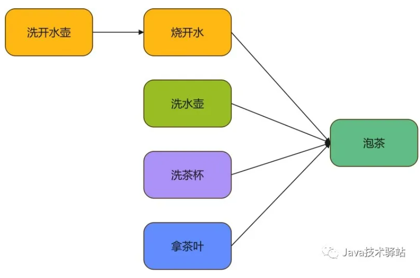
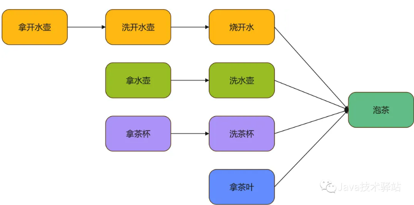

# demo01

> 参考链接：[CompletableFuture优化接口](https://mp.weixin.qq.com/s/APMYclYupMokZvf5ZWdYAQ)

# demo02

> 参考链接：[未来已来：掌握 CompletableFuture 的异步魔法](https://mp.weixin.qq.com/s/UVycTRHLbbvwoihWsdvwuw)

## 构建异步操作

### 构建异步操作

CompletableFuture 提供了多种方法用于构建异步操作。

#### runAsync

> runAsync()：用于异步执行没有返回值的任务。

它有两个重载方法：

```java
public static CompletableFuture<Void> runAsync(Runnable runnable)
public static CompletableFuture<Void> runAsync(Runnable runnable, Executor executor)
```

这两个方法的区别在于：

- runAsync(Runnable runnable)会使用 ForkJoinPool 作为它的线程池执行异步代码。
- runAsync(Runnable runnable, Executor executor) 则是使用指定的线程池执行异步代码。

#### supplyAsync

> supplyAsync()**：** 用于异步执行有返回值的任务。

supplyAsync() 也有两个重载方法，区别 runAsync() 和一样：

```java
public static <U> CompletableFuture<U> supplyAsync(Supplier<U> supplier)
public static <U> CompletableFuture<U> supplyAsync(Supplier<U> supplier, Executor executor
```

#### completedFuture

> completedFuture()：创建一个已完成的 CompletableFuture，它包含特定的结果。

> 注意：使用默认线程池会有一个：在主线程任务执行完以后，如果异步线程执行任务还没执行完，它会直接把异步任务线程清除掉，因为默认线程池中的都是守护线程 ForkJoinPool，当没有用户线程以后，会随着 JVM 一起清除。

### 获取结果

CompletableFuture 提供了 get() 和 join() 方法用于我们获取计算结果：

```java
public T get() throws InterruptedException, ExecutionException
public T get(long timeout, TimeUnit unit) throws InterruptedException, ExecutionException, TimeoutException
public T join()
```

get() 有两个重载方法：

- get()：会阻塞当前线程，直到计算完成并返回结果
- get(long timeout, TimeUnit unit)：有阻塞时间，如果在指定的超时时间内未能获取到结果，会抛出 `TimeoutException` 异常。

而 get()和 join()的区别则在于：

- get()会抛出 InterruptedException 和 ExecutionException这两个受检查异常，我们必须显式地在代码中处理这些异常或将它们抛出。
- join()不会抛出受检查异常，所以在使用过程中代码会显得更加简洁，但是如果任务执行中发生异常，它会包装在 CompletionException中，需要在后续代码中处理。

### 结果、异常处理

当 CompletableFuture 因为异步任务执行完成或者发生异常而完成时，可以执行特定的 Action，主要方法有：

```java
public CompletableFuture<T> whenComplete(BiConsumer<? super T,? super Throwable> action)
public CompletableFuture<T> whenCompleteAsync(BiConsumer<? super T,? super Throwable> action)
public CompletableFuture<T> whenCompleteAsync(BiConsumer<? super T,? super Throwable> action, Executor executor)
public CompletableFuture<T> exceptionally(Function<Throwable, ? extends T> fn) 
```

#### whenComplete

> whenComplete(BiConsumer<? super T,? super Throwable> action)

接受一个 Consumer参数，该参数接受计算的结果（如果成功）或异常（如果发生异常）并执行相应的操作。

该方法是同步执行，回调函数是在触发它的 CompletableFuture 所在的线程中执行，且它会阻塞当前线程。

#### whenCompleteAsync

> whenCompleteAsync(BiConsumer<? super T,? super Throwable> action)

异步执行，回调函数会在默认的 ForkJoinPool 的线程中执行，但是它不会阻塞当前线程。

> whenCompleteAsync(BiConsumer<? super T,? super Throwable> action, Executor executor)

它与前一个方法相似，只不过可以执行 Action 执行的线程池。

#### exceptionally

> exceptionally(Function<Throwable, ? extends T> fn)

exceptionally() 用于处理异步操作中的异常情况，当异步操作发生异常时，该回调函数将会被执行，可以在该回调函数中处理异常情况。exceptionally() 返回一个新的 CompletableFuture 对象，其中包含了异常处理的结果或者异常对象。

### 结果转换

结果转换，就是将上一段任务的执行结果作为下一阶段任务的入参参与重新计算，产生新的结果。

#### thenApply、thenApplyAsync

> thenApply()和thenApplyAsync()：用于将一个 CompletableFuture 的结果应用于一个函数，并返回一个新的CompletableFuture，表示转换后的结果。

#### thenCompose、thenComposeAsync

> thenCompose()和 thenComposeAsync() ：它用于将一个 CompletableFuture 的结果应用于一个函数，该函数返回一个新的 CompletableFuture。

thenCompose()与 thenApply() 两者的返回值虽然都是新的 CompletableFuture，但是 thenApply() 由于它的函数的返回值仅仅只是结果，所以它通常用于对异步操作的结果进行简单的转换，而 thenCompose() 则允许链式地组合多个异步操作。虽然两者都有可能实现相同的效果（比如上面例子），但是他们的使用场景和意义还是有区别的。

### 结果消费

结果消费则是只对结果执行 Action，而不返回新的计算值。

#### thenAccept

> thenAccept()：用于处理异步操作的结果，但不返回任何结果。

#### thenAcceptBoth

> thenAcceptBoth()：用于处理两个不同的 CompletableFuture 异步操作的结果，并执行操作，但不返回新的结果。

```java
public CompletableFuture<Void> thenAcceptBoth(CompletableFuture<? extends U> other, BiConsumer<? super T, ? super U> action)
```

- other：为另外一个 CompletableFuture，它包含了另一个异步操作的结果。
- action：类型为 BiConsumer，它接受两个参数，分别表示第一个 CompletableFuture 的结果和第二个 CompletableFuture 的结果。

#### thenRun

> thenRun()：用于在一个 CompletableFuture 异步操作完成后执行操作，而不关注计算的结果

thenRun() 通常用于执行其他作用的操作、清理工作、或在异步操作完成后触发其他操作。

### 结果组合

#### thenCombine

thenCombine()用于将两个不同的 CompletableFuture 异步操作的结果合并为一个新的结果，并执行操作。该方法允许我们在两个异步操作都完成后执行一个操作，它接受两个结果作为参数，并返回一个新的结果。

```java
public <U, V> CompletableFuture<V> thenCombine(CompletableFuture<? extends U> other, BiFunction<? super T, ? super U, ? extends V> action)
```

- other：表示另外一个 CompletableFuture，它包含了该 CompletableFuture 的计算结果
- action：类型是 BiFunction，它接受两个参数，分别是第一个 CompletableFuture 的计算结果和第二个 CompletableFuture 的计算结果。

### 任务交互

#### applyToEither

applyToEither() 用于处理两个不同的 CompletableFuture 异步操作中的任何一个完成后，将其结果应用于一个函数，并返回一个新的 CompletableFuture 表示该函数的输出结果。该方法允许我们在两个异步操作中的任何一个完成时执行操作，而不需要等待它们都完成。

#### acceptEither

acceptEither() 与 applyToEither() 一样，也是等待两个 CompletableFuture 中的任意一个执行完成后执行操作，但是它不返回结果。

#### runAfterEither

runAfterEither()用于在两个不同的 CompletableFuture 异步操作中的任何一个完成后执行操作，而不依赖操作的结果。这个方法通常用于在两个异步操作中的任何一个成功完成时触发清理操作或执行某些操作，而不需要返回值。

#### runAfterBoth

runAfterBoth() 用于在两个不同的 CompletableFuture 异步操作都完成后执行操作，而不依赖操作的结果。这个方法通常用于在两个异步操作都完成时触发某些操作或清理工作，而不需要返回值。

#### anyOf

anyOf() 是用于处理多个 CompletableFuture 对象的**静态方法**，它允许我们等待多个异步操作中的任何一个完成，并执行相应的操作。它类似于多个异步操作的并发执行，只要有一个操作完成，它就会返回一个新的 CompletableFuture 对象，表示第一个完成的操作。

anyOf() 是一个可变参数，我们可以传入任意数量的 CompletableFuture 对象。

#### allOf

anyOf() 是任一一个异步任务完成就会触发，而 allOf() 则需要所有异步都要完成。

## CompletableFuture 的任务编排

这里了一个烧水泡茶的例子，最优解如下



为了能够更好地验证 CompletableFuture 的任务编排功能，下面将其进行扩展：



```java
@Slf4j
public class TeaTest {
    public static void main(String[] args) throws InterruptedException {
        CompletableFuture<String> future1 = CompletableFuture.supplyAsync(() -> {
            log.info("拿开水壶");
            return "开水壶";
        });

        CompletableFuture<String> future2 = CompletableFuture.supplyAsync(() -> {
            log.info("拿水壶");
            return "水壶";
        });

        CompletableFuture<String> future3 = CompletableFuture.supplyAsync(() -> {
            log.info("拿茶杯");
            return "茶杯";
        });

        CompletableFuture<String> future4 = CompletableFuture.supplyAsync(() -> {
            log.info("拿茶叶");
            return "西湖龙井";
        });

        CompletableFuture<String> future11 = future1.thenApply((result) -> {
            log.info("拿到" + result + ",开始洗" + result);
            return "干净的开水壶";
        });

        CompletableFuture<String> future12 = future11.thenApply((result) -> {
            log.info("拿到" + result + ",开始烧开水");
            return "烧开水了";
        });

        CompletableFuture<String> future21 = future2.thenApply((result) -> {
            log.info("拿到" + result + ",开始洗" + result);
            return "干净的水壶";
        });

        CompletableFuture<String> future31 = future3.thenApply((result) -> {
            log.info("拿到" + result + ",开始洗" + result);
            return "干净的茶杯";
        });


        CompletableFuture<Void> future5 = CompletableFuture.allOf(future4, future12, future21, future31);
        future5.thenRun(() -> {
            log.info("泡好了茶，还是喝美味的西湖龙井茶");
        });

        TimeUnit.SECONDS.sleep(5);
    }
}
```

## CompletableFuture API 总结

CompletableFuture的 API 比较多，不同的方法有不同的使用场景，简单列下面表格

**构建异步操作**

| 方法              | 说明                                      | 有无返回值 |
| :---------------- | :---------------------------------------- | :--------- |
| `runAsync`        | 异步执行任务，默认 ForkJoinPool 线程池    | 无返回值   |
| `supplyAsync`     | 异步执行任务，默认 ForkJoinPool 线程池    | 有返回值   |
| `completedFuture` | 创建一个已经完成的 CompletableFuture 对象 | 有返回值   |

**两个线程依次执行**

| 方法            | 说明                                                         | 有无返回值           |
| :-------------- | :----------------------------------------------------------- | :------------------- |
| `thenApply`     | 获取前一个线程的执行结果，第二个线程处理该结果，生成一个新的 CompletableFuture 对象 | 有返回值             |
| `thenAccept`    | 获取前一个线程的执行结果，第二个线程消费结果，不会返还给调用端 | 无返回值             |
| `thenRun`       | 第一个线程执行完后，再执行，它忽略第一个线程的执行结果，也不返回结果 | 无返回值             |
| `thenCompose`   | 获取前一个线程的执行结果，对其进行组合，返回新的 CompletableFuture 对象 | 有返回值             |
| `whenComplete`  | 获取前一个线程的结果或异常，消费                             | 不影响上一线程返回值 |
| `exceptionally` | 线程异常执行，配合whenComplete 使用                          | 有返回值             |
| `handle`        | 相当于whenComplete + exceptionally                           | 有返回值             |

**等待2个线程都执行完**

| 方法             | 说明                                            | 有无返回值 |
| :--------------- | :---------------------------------------------- | :--------- |
| `thenCombine`    | 2个线程都要有返回值，等待都结束，结果合并转换   | 有返回值   |
| `thenAcceptBoth` | 2个线程都要有返回值，等待都结束，结果合并消费   | 无返回值   |
| `runAfterBoth`   | 2个线程无需要有返回值，等待都结束，执行其他逻辑 | 无返回值   |

**等待2个线程任一执行完**

| 方法             | 说明                                            | 有无返回值 |
| :--------------- | :---------------------------------------------- | :--------- |
| `applyToEither`  | 2个线程都要有返回值，等待任一结束，转换其结果   | 有返回值   |
| `acceptEither`   | 2个线程都要有返回值，等待任一结束，消费其结果   | 无返回值   |
| `runAfterEither` | 2个线程无需有返回值，等待任一结束，执行其他逻辑 | 无返回值   |

**多个线程等待**

| 方法    | 说明                   | 有无返回值 |
| :------ | :--------------------- | :--------- |
| `anyOf` | 多个线程任一执行完返回 | 有返回值   |
| `allOf` | 多个线程全部执行完返回 | 无返回值   |

## 应用场景

> https://www.cnblogs.com/zwh0910/p/17483514.html

### 描述依赖关系

thenApply() 把前面异步任务的结果，交给后面的Function

thenCompose()用来连接两个有依赖关系的任务，结果由第二个任务返回

### 描述and聚合关系

thenCombine 任务合并，有返回值

thenAccepetBoth 两个任务执行完成后，将结果交给thenAccepetBoth消耗，无返回值

runAfterBoth 两个任务都执行完成后，执行下一步操作（Runnable）

### 描述or聚合关系

applyToEither 两个任务谁执行的快，就使用那一个结果，有返回值

acceptEither 两个任务谁执行的快，就消耗那一个结果，无返回值

runAfterEither 任意一个任务执行完成，进行下一步操作(Runnable)

### 并行执行

CompletableFuture类自己也提供了anyOf()和allOf()用于支持多个CompletableFuture并行执行。


