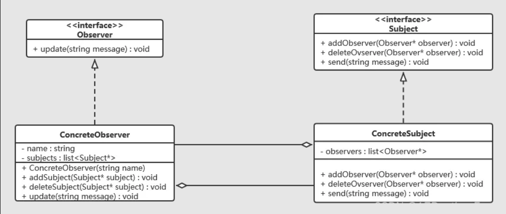
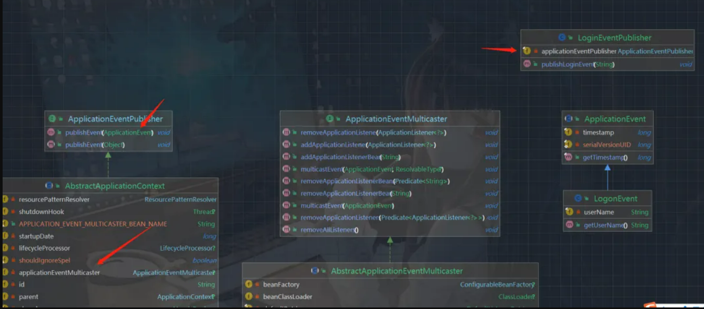
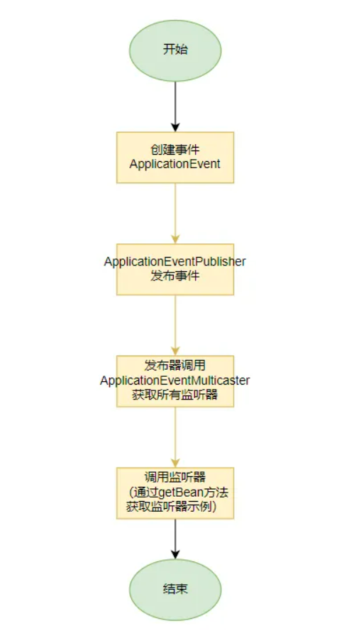

# test01：脱敏方式实现1

> 参考链接：https://mp.weixin.qq.com/s/xjnwBzNizMQO6S5WFOaf5A

# test02：脱敏方式实现2

> 参考链接：https://mp.weixin.qq.com/s/6I61HQ-jjzV8X5kZB5LYrQ

# test03：脱敏方式自定义代码

自定义代码项目使用

# test04：Spring Event监听

> 参考链接：https://mp.weixin.qq.com/s/0AoGh2W_nHRNdAavjo4R2Q

## Spring Event

- • 大家好，我是 Lorin，Spring事件（Spring Event）是Spring框架的一项功能，它允许不同组件之间通过发布-订阅机制进行解耦的通信。在Spring中，事件是表示应用程序中特定事件的对象，例如用户注册、订单创建、数据更新等。当这些事件发生时，可以通知其他组件来执行相应的操作。
- • 下面我们将学习 Spring Event 的使用方式和底层原理，帮助我们在实际项目开发中正确使用 Spring Event：

## Spring Event 简单小例子

- • 下面是一个使用Spring事件处理用户登录的简单示例。在此示例中，我们将创建一个Spring Boot应用程序，演示如何使用Spring事件来处理用户登录事件。

创建一个登录事件

- • 创建一个自定义的事件类，用于表示用户登录事件，例如LogonEvent：

```java
public class LogonEvent extends ApplicationEvent {

    private final String userName;

    public LogonEvent(Object source, String username) {
        super(source);
        this.userName = username;
    }

    public String getUserName() {
        return userName;
    }
}
```

### 创建事件发布者

- • 创建一个事件发布者，用于发布用户登录事件：

```java
@Service
public class LoginEventPublisher {

    private final ApplicationEventPublisher applicationEventPublisher;

    public LoginEventPublisher(ApplicationEventPublisher applicationEventPublisher) {
        this.applicationEventPublisher = applicationEventPublisher;
    }

    public void publishLoginEvent(String username) {
        LogonEvent loginEvent = new LogonEvent(this, username);
        applicationEventPublisher.publishEvent(loginEvent);
    }
}
```

### 创建事件监听器

- • 创建事件监听器，用于处理用户登录事件，支持创建一个或者多个类似发布订阅模式，本示例中创建了两个时间监听器：

```java
// 日志处理事件监听器
@Component
public class LoginEventPrintLogListener {

    @EventListener
    public void handleUserLoginEvent(LogonEvent event) {
        String username = event.getUserName();
        // 在这里执行处理用户登录事件的逻辑，例如记录日志或触发其他操作
        System.out.println("User logged in: " + username);
    }
}

// 登录消息通知事件监听器
@Component
public class LoginEventMessageNoticeListener {

    @EventListener
    public void LoginEventMessageNoticeListener(LogonEvent event) {
        String username = event.getUserName();
        // 发送消息通知用户
        System.out.println("message send User logged in: " + username);
    }
}
```

### 模拟用户登录

- • 这里为了方便测试，使用CommandLineRunner启动时模拟登录：

```
@Component
public class MyCommandLineRunner implements CommandLineRunner {

    private final LoginEventPublisher loginEventPublisher;

    public MyCommandLineRunner(LoginEventPublisher loginEventPublisher) {
        this.loginEventPublisher = loginEventPublisher;
    }

    @Override
    public void run(String... args) {
        // 在应用程序启动后执行的自定义逻辑
        System.out.println("MyCommandLineRunner executed!");

        // 登录成功
        // 登录执行后逻辑
        loginEventPublisher.publishLoginEvent("小王");
    }
}
```

### 运行结果

```shell
2023-10-13 16:04:02.021  INFO 5356 --- [           main] w.s.c.ServletWebServerApplicationContext : Root WebApplicationContext: initialization completed in 1250 ms
2023-10-13 16:04:02.382  INFO 5356 --- [           main] o.s.b.w.embedded.tomcat.TomcatWebServer  : Tomcat started on port(s): 8080 (http) with context path ''
2023-10-13 16:05:31.792  INFO 5356 --- [           main] c.e.s.SpringBootTestMavenApplication     : Started SpringBootTestMavenApplication in 200.49 seconds (JVM running for 201.165)

MyCommandLineRunner executed!
message send User logged in: 小王
User logged in: 小王
```

## 特性

### 事件驱动

- • 基于事件驱动的机制，它允许组件在特定事件发生时被通知并响应。

### 解耦

- • 帮助在应用内不同组件之间实现解耦。发布事件的组件不需要了解事件的具体监听者，监听者只需要订阅感兴趣的事件即可。

### 同步处理和异步处理

- • 支持同步或异步方式处理事件，通过@Async注解或配置异步事件处理器。
- • 即没有配置异步的情况下，由当前线程同步处理事件。

### 使用建议

- • 适用于内部组件之间的通信和解耦，本身不提供强制的可靠性保证机制，可靠性通常由应用开发者来保证。常用于用户注册事件、库存更新事件等轻量级事件的处理。
- • 而消息队列更适用于跨应用、跨服务、分布式系统以及异步处理、或者高并发场景，同时提供了一些现成的可靠性方案供我们选择。

## 监听器异步实现 @Async

- • 默认使用同步处理的方式，若需实现监听器异步处理我们可以结合 @EnableAsync 注解使用，我们将上文的 LoginEventPrintLogListener 使用异步线程处理：

### 示例

```java
@SpringBootApplication
// 开启 Async
@EnableAsync
public class SpringBootTestMavenApplication {

    public static void main(String[] args) {
        SpringApplication.run(SpringBootTestMavenApplication.class, args);
    }
}


@Component
public class LoginEventPrintLogListener {

    @EventListener
    // 配置任务异步
    @Async
    public void handleUserLoginEvent(LogonEvent event) throws Exception {
        String username = event.getUserName();
        // 在这里执行处理用户登录事件的逻辑，例如记录日志或触发其他操作
        System.out.println("User logged in: " + username);
    }
}
```

### 深入了解 Spring Event

### 背后的观察者模式（Observer Pattern）

- • Spring事件（Spring Events）实际上是一种基于观察者模式（Observer Pattern）的实现。

#### 简单回顾一下观察者模式

- • 观察者模式是一种设计模式，用于定义对象之间的一对多依赖关系，当一个对象的状态发生变化时，其所有依赖对象都会收到通知并自动更新。

##### 四个关键元素

- • 主题（Subject）：也称为被观察者，它维护了一个观察者列表并提供方法来添加、删除和通知观察者。主题的状态变化会通知观察者。
- • 观察者（Observer）：观察者是依赖于主题的对象，它们注册自己以接收主题的通知。当主题状态发生变化时，观察者会收到通知并执行相应的操作。
- • 具体主题（Concrete Subject）：具体主题是主题的具体实现，它通常包括状态变化、观察者列表、以及通知观察者的方法。
- • 具体观察者（Concrete Observer）：具体观察者是观察者的具体实现，它实现了更新操作以响应主题的通知。

##### 类图



#### 优点

##### 松耦合

- • 主题和观察者之间的耦合度较低，主题无需了解观察者的具体实现。

##### 可维护性

- • 可以轻松添加、删除和更改观察者，而无需修改主题。

##### 分布式通知

- • 允许将通知传递给多个观察者，以便它们可以独立地响应通知，即支持发布订阅模式。

## 源码解析

- • 三个重要的类



### ApplicationEventPublisher

- • 事件发布器，负责发布事件，可以看到我们自定义的发布器 LoginEventPublisher 持有一个 ApplicationEventPublisher 发布器用于发布事件。

```java
@FunctionalInterface
public interface ApplicationEventPublisher {

    default void publishEvent(ApplicationEvent event) {
        publishEvent((Object) event);
    }

    void publishEvent(Object event);
}
```

### ApplicationEventMulticaster

- • 负责管理我们的监听者列表，并提供给发布器使用。

```java
public interface ApplicationEventMulticaster {

    void addApplicationListener(ApplicationListener<?> listener);

    void addApplicationListenerBean(String listenerBeanName);

    void removeApplicationListener(ApplicationListener<?> listener);

    void removeApplicationListenerBean(String listenerBeanName);

    void removeApplicationListeners(Predicate<ApplicationListener<?>> predicate);

    void removeApplicationListenerBeans(Predicate<String> predicate);

    void multicastEvent(ApplicationEvent event);

    void multicastEvent(ApplicationEvent event, @Nullable ResolvableType eventType);
}
```

### ApplicationEvent

- • 事件抽象类，用于实现我们的事件。

```java
public abstract class ApplicationEvent extends EventObject {

    /** use serialVersionUID from Spring 1.2 for interoperability. */
    private static final long serialVersionUID = 7099057708183571937L;

    /** System time when the event happened. */
    private final long timestamp;


    public ApplicationEvent(Object source) {
        super(source);
        this.timestamp = System.currentTimeMillis();
    }
}
```

## 执行流程



- • 源码版本：JDK 1.8

### 发布事件

- • 从 publishEvent() 方法出发，一直到 AbstractApplicationContext 类中：

```java
// org.springframework.context.support.AbstractApplicationContext#publishEvent
    protected void publishEvent(Object event, @Nullable ResolvableType eventType) {
        Assert.notNull(event, "Event must not be null");

        // Decorate event as an ApplicationEvent if necessary
        ApplicationEvent applicationEvent;
        if (event instanceof ApplicationEvent) {
            applicationEvent = (ApplicationEvent) event;
        }
        else {
            applicationEvent = new PayloadApplicationEvent<>(this, event);
            if (eventType == null) {
                eventType = ((PayloadApplicationEvent<?>) applicationEvent).getResolvableType();
            }
        }

        // Multicast right now if possible - or lazily once the multicaster is initialized
        // ApplicationEventMulticaster 未初始化完成时将 applicationEvent 暂存
        if (this.earlyApplicationEvents != null) {
            this.earlyApplicationEvents.add(applicationEvent);
        }
        else {
            // 获取监听管理器并进行广播
            getApplicationEventMulticaster().multicastEvent(applicationEvent, eventType);
        }

        // Publish event via parent context as well...
        if (this.parent != null) {
            if (this.parent instanceof AbstractApplicationContext) {
                ((AbstractApplicationContext) this.parent).publishEvent(event, eventType);
            }
            else {
                this.parent.publishEvent(event);
            }
        }
    }
```

### 广播执行监听器

```java
// org.springframework.context.event.SimpleApplicationEventMulticaster#multicastEvent

    @Override
    public void multicastEvent(final ApplicationEvent event, @Nullable ResolvableType eventType) {
        ResolvableType type = (eventType != null ? eventType : resolveDefaultEventType(event));
        Executor executor = getTaskExecutor();
        // 循环遍历调用监听器
        for (ApplicationListener<?> listener : getApplicationListeners(event, type)) {
            // 是否存在线程池 异步执行逻辑
            if (executor != null) {
                executor.execute(() -> invokeListener(listener, event));
            }
            else {
                // 非异步线程处理
                invokeListener(listener, event);
            }
        }
    }
    
    protected void invokeListener(ApplicationListener<?> listener, ApplicationEvent event) {
        ErrorHandler errorHandler = getErrorHandler();
        // 是否存在 ErrorHandler 
        if (errorHandler != null) {
            try {
                doInvokeListener(listener, event);
            }
            catch (Throwable err) {
                errorHandler.handleError(err);
            }
        }
        else {
            doInvokeListener(listener, event);
        }
    }

// org.springframework.context.event.ApplicationListenerMethodAdapter#onApplicationEvent
    @Override
    public void onApplicationEvent(ApplicationEvent event) {
        processEvent(event);
    }

    public void processEvent(ApplicationEvent event) {
        Object[] args = resolveArguments(event);
        if (shouldHandle(event, args)) {
            // 调用监听器
            Object result = doInvoke(args);
            if (result != null) {
                handleResult(result);
            }
            else {
                logger.trace("No result object given - no result to handle");
            }
        }
    }

    protected Object doInvoke(Object... args) {
        // 从 spring 容器中通过 getBean() 方法获取监听器Bean
        // 因此支持监听器动态加载
        Object bean = getTargetBean();
        // Detect package-protected NullBean instance through equals(null) check
        if (bean.equals(null)) {
            return null;
        }

        ReflectionUtils.makeAccessible(this.method);
        try {
            return this.method.invoke(bean, args);
        }
        catch (IllegalArgumentException ex) {
            assertTargetBean(this.method, bean, args);
            throw new IllegalStateException(getInvocationErrorMessage(bean, ex.getMessage(), args), ex);
        }
        catch (IllegalAccessException ex) {
            throw new IllegalStateException(getInvocationErrorMessage(bean, ex.getMessage(), args), ex);
        }
        catch (InvocationTargetException ex) {
            // Throw underlying exception
            Throwable targetException = ex.getTargetException();
            if (targetException instanceof RuntimeException) {
                throw (RuntimeException) targetException;
            }
            else {
                String msg = getInvocationErrorMessage(bean, "Failed to invoke event listener method", args);
                throw new UndeclaredThrowableException(targetException, msg);
            }
        }
    }
```

### ApplicationEventMulticaster 构建过程

- • ApplicationEventMulticaster 在 Spring 容器初始化过程中被创建：

```java
# 在核心方法refresh中建立applicationEventMulticaster
// Initialize message source for this context.
initMessageSource();

// Initialize event multicaster for this context.
// 在Spring容器中初始化事件广播器，事件广播器用于事件的发布
initApplicationEventMulticaster();

// Initialize other special beans in specific context subclasses.
onRefresh();

// Check for listener beans and register them.
// 把Spring容器内的事件监听器和BeanFactory中的事件监听器都添加的事件广播器中。
registerListeners();

// Instantiate all remaining (non-lazy-init) singletons.
finishBeanFactoryInitialization(beanFactory);

// Last step: publish corresponding event.
finishRefresh();

# 主要逻辑在 initApplicationEventMulticaster 和 registerListeners
// 初始化事件广播器
protected void initApplicationEventMulticaster() {
    ConfigurableListableBeanFactory beanFactory = getBeanFactory();
    // 如果用户手动新建了一个名为applicationEventMulticaster类型为ApplicationEventMulticaster的bean，则将这个bean作为事件广播器
    if (beanFactory.containsLocalBean(APPLICATION_EVENT_MULTICASTER_BEAN_NAME)) {
        this.applicationEventMulticaster =
                beanFactory.getBean(APPLICATION_EVENT_MULTICASTER_BEAN_NAME, ApplicationEventMulticaster.class);
        if (logger.isTraceEnabled()) {
            logger.trace("Using ApplicationEventMulticaster [" + this.applicationEventMulticaster + "]");
        }
    }
    else {
        // 否则新建一个SimpleApplicationEventMulticaster作为默认的事件广播器
        this.applicationEventMulticaster = new SimpleApplicationEventMulticaster(beanFactory);
        beanFactory.registerSingleton(APPLICATION_EVENT_MULTICASTER_BEAN_NAME, this.applicationEventMulticaster);
        if (logger.isTraceEnabled()) {
            logger.trace("No '" + APPLICATION_EVENT_MULTICASTER_BEAN_NAME + "' bean, using " +
                    "[" + this.applicationEventMulticaster.getClass().getSimpleName() + "]");
        }
    }
}

// 注册监听器
protected void registerListeners() {
    // Register statically specified listeners first.
    // 把提前存储好的监听器添加到监听器容器中
    for (ApplicationListener<?> listener : getApplicationListeners()) {
        getApplicationEventMulticaster().addApplicationListener(listener);
    }

    // Do not initialize FactoryBeans here: We need to leave all regular beans
    // uninitialized to let post-processors apply to them!
    // 获取类型是ApplicationListener的beanName集合，此处不会去实例化bean
    String[] listenerBeanNames = getBeanNamesForType(ApplicationListener.class, true, false);
    for (String listenerBeanName : listenerBeanNames) {
        getApplicationEventMulticaster().addApplicationListenerBean(listenerBeanName);
    }

    // Publish early application events now that we finally have a multicaster...
    Set<ApplicationEvent> earlyEventsToProcess = this.earlyApplicationEvents;
    this.earlyApplicationEvents = null;
    // 如果存在earlyEventsToProcess，提前处理这些事件
    if (earlyEventsToProcess != null) {
        for (ApplicationEvent earlyEvent : earlyEventsToProcess) {
            getApplicationEventMulticaster().multicastEvent(earlyEvent);
        }
    }
}
```

## 总结

- • Spring事件（Spring Events）是Spring框架的一项功能，基于观察者模式实现，适用于内部组件之间的通信和解耦，常用于用户注册事件、库存更新事件等轻量级事件的处理。
- • Spring事件本身不提供强制的可靠性保证机制，可靠性需要由应用开发者来保证。
- • 跨应用、跨服务、分布式系统以及异步处理、或者高并发场景，不适合Spring事件，此时考虑消息队列更加合适。

# test05：Spring Event监听2

> 参考链接：https://mp.weixin.qq.com/s/eoLF7CRLWTx-tLvqh2CUkQ，事件管理模块

# test06：SpringWeb许可证号校验

根据Mac判断是否序列号是否合法，可拓展比较开始时间比较，结束时间比较，是否永久，是否临时，通过定时任务来控制临时许可证号